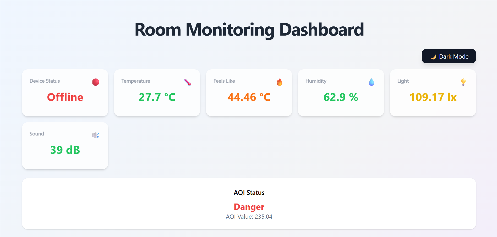
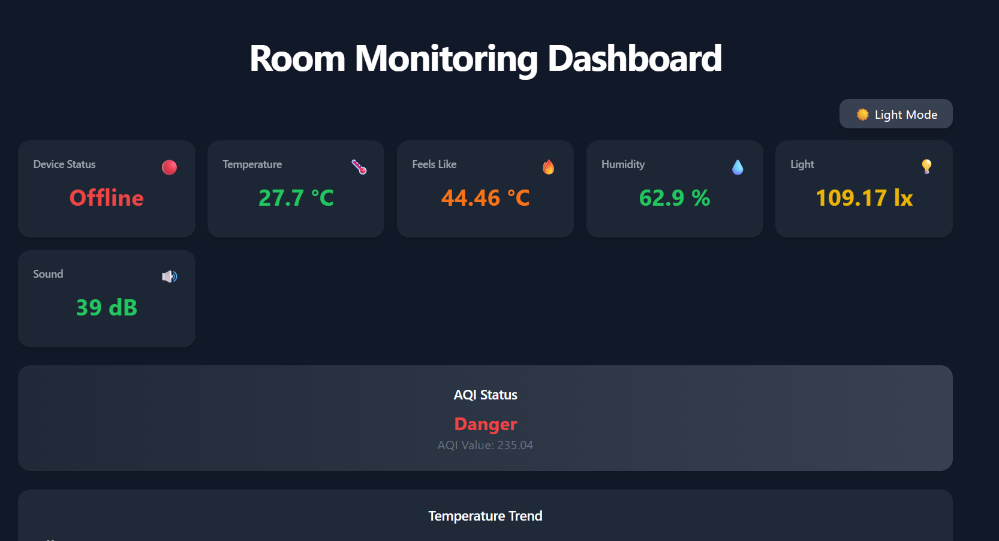
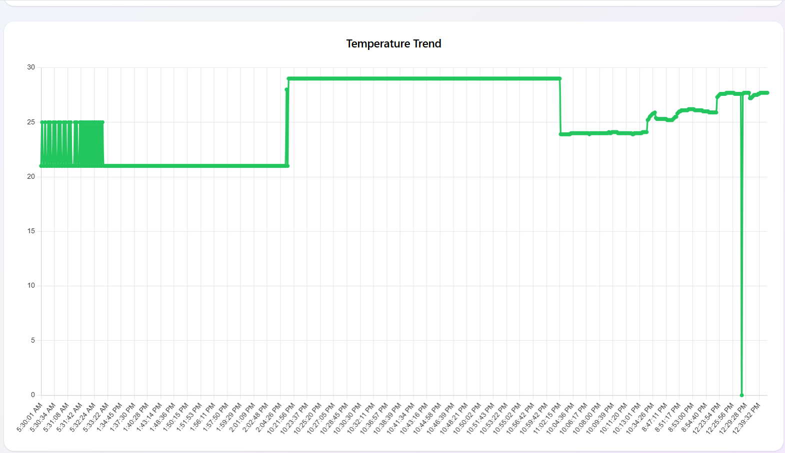
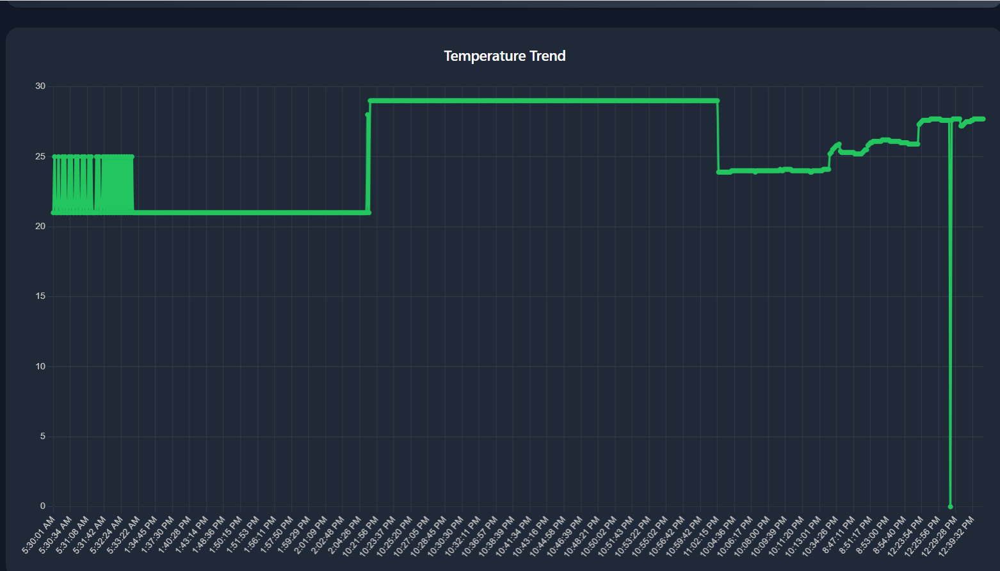
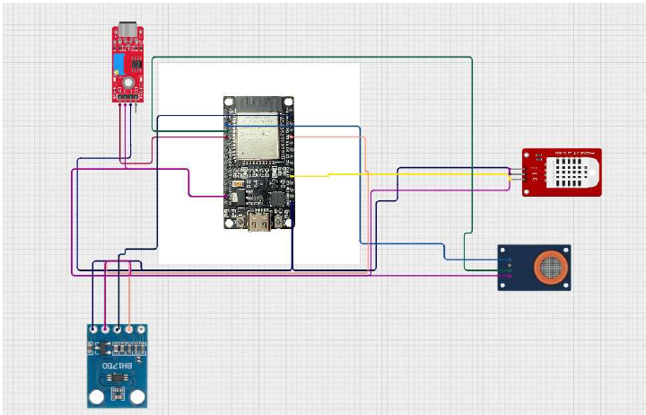

# Room Monitoring Dashboard


A real-time **Room Monitoring Dashboard** built using **React**, **Firebase Realtime Database**, and **Chart.js**. The application monitors room parameters such as temperature, humidity, air quality, and light intensity, providing live updates through an interactive dashboard.

## 🌐 Live Demo

🔗 https://room-monitoring-dashboard.vercel.app/

---

## 🚀 Features

- 📡 Real-time room enviroment monitoring
- 🌡️ Temperature monitoring
- 💧 Humidity monitoring
- 🌫️ Air quality monitoring
- 💡 Light intensity monitoring
- 📊 Interactive charts and trends
- 🌙 Dark mode support
- 📱 Responsive dashboard
- 🔥 Firebase Realtime Database integration

---

## 🛠️ Tech Stack

| Category | Technology |
|----------|------------|
| Frontend | React, Vite |
| Database | Firebase Realtime Database |
| Charts | Chart.js |
| Deployment | Vercel |

---

# 📸 Screenshots

## Dashboard (Light Mode)

<p align="center">
  
</p>

---

## Dashboard (Dark Mode)

<p align="center">
  
</p>

---

## Temperature Trend (Light Mode)

<p align="center">
  
</p>

---

## Temperature Trend (Dark Mode)

<p align="center">
  
</p>

---

## Circuit Diagram

<p align="center">
  
</p>

---

## ⚙️ Installation

### Clone the repository

```bash
git clone https://github.com/DhruvalRakeshGohil2006/RoomMonitoringDashboard.git
```

### Install dependencies

```bash
npm install
```

### Start the development server

```bash
npm run dev
```

### Build for production

```bash
npm run build
```

---

## 📂 Project Structure

```text
RoomMonitoringDashboard
│
├── assets/
├── public/
├── src/
│   ├── components/
│   ├── pages/
│   ├── firebase/
│   └── App.jsx
├── package.json
└── vite.config.js
```

---

## 🔮 Future Enhancements

- User authentication
- Historical data analytics
- Email/SMS alerts
- Multi-room monitoring
- Data export (CSV/PDF)
- Mobile application

---

## 👨‍💻 Author

**Dhruval Rakesh Gohil**

- LinkedIn: https://www.linkedin.com/in/dhruval-rakesh-gohil
- GitHub: https://github.com/DhruvalRakeshGohil2006

---

⭐ If you found this project useful, consider giving it a **Star**.
